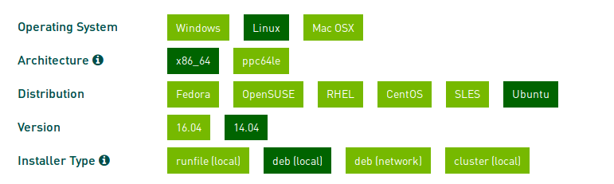

# CUDA Installation
The step by step processes of `CUDA 8.0` installation in `Ubuntu(14.04)` is provided here. 

### Hardware & cuda version
The following installation has been implemented and successfully tested on [CUDA 8.0](http://on-demand.gputechconf.com/gtc/2016/webinar/cuda-8-features-overview.pdf) and [NVIDIA TITAN X(Pwered by Pascal) GPU](http://www.geforce.com/hardware/10series/titan-x-pascal). However the method can simply be used for older version of `CUDA` and older `GPU architectures`.

## CUDA preinstallation
Before installation of CUDA, It is recommended to uninstall all NVIDIA drivers in order to prevent having any conflict with the new CUDA driver.
```bash
sudo apt-get purge nvidia*
```
Still some of the modules might be stuck in the kernel. Get their names by:
```bash
dkms status
```
The output should be `void` or if there is any remnant module the output is as follows:
```bash
nvidia-current-updates, "module_version", "kernel_version", x86_64: installed
```
`Module version` and `kernel version` are of format `304.4` and `3.1.0-36-generic` respectively. These modules should be removed by the following command:
```bash
sudo dkms remove nvidia-current-updates/module_version -k kernel_version
```
Now the CUDA can safely be installed using the aforementioned procedure in the previous section.

**WARNING:** DO NOT REBOOT AT THIS STAGE. ALL THE NIVIDIA DRIVERS HAVE BEEN REMOVED AND IF YOU REBOOT THERE IS NO DRIVER. REBOOT AFTER INTALLATION OF CUDA WHICH IS THE NEXT STEP.


### CUDA installation

#### Installation Using NVIDIA Released Files.

For the [NVIDIA TITAN X(Pwered by Pascal) GPU](http://www.geforce.com/hardware/10series/titan-x-pascal), installing CUDA 8.0 is necessary. The CUDA 8.0 download file and installation procedure can be found [here](https://developer.nvidia.com/cuda-downloads). The system platform has to be chosen as the following image: .

First using the terminal go to the folder that the downloaded `.deb` file is located. Now the installation has to be done as follows:

```bash
sudo dpkg -i cuda-repo-ubuntu1404-8-0-local_8.0.44-1_amd64.deb
sudo apt-get update
sudo apt-get install cuda
```

It is worth mentioning that, the described procedure is the straight-forward approach of installing CUDA. Issues like `black screen`, `stuck in login page` and other incompatibilities may happen which are beyond the scope of this documentation.

The last step of installation CUDA is to add the path of it to `source bash file`:
```bash
sudo gedit ~/.bashrc
```

The the two following line must be added to the file with regard to `CUDA 8.0` installation:

```bash
export PATH=/usr/local/cuda-8.0/bin:$PATH
export LD_LIBRARY_PATH=/usr/local/cuda-8.0/lib64:$LD_LIBRARY_PATH
```

`NOTE:` This istallation can be used for any CUDA version however the aforementioned PATH should be addressed based on the installed CUDA verion.

#### Installation Using Current-Update Package.
Alternatively `current-updates` can be used since it is a package that is cloned from NVIDIA’s releases,
but it is officially tested and packaged by Ubuntu. The command is as follows:

```bash
sudo apt-get install nvidia-current-updates nvidia-settings-updates
```


### Preinstallation and CUDA compatibility
Now the assumption is that the [CUDA](http://docs.nvidia.com/cuda/cuda-installation-guide-linux/#axzz4MnU6Gq6E) is already installed.

Check the supporting GPU(s) and Ubuntu version using the following command:

```bash
lspci | grep -i nvidia
uname -m && cat /etc/*release
 gcc --version
```

### CuDNN Installation

For increasing the performance(loosly speaking and not necessarily) installing [CuDNN](https://developer.nvidia.com/cudnn) is recommended.
After downloading the relevent file to the system, assume the file is downloaded and extracted in the <directory> under
the name of `cuda`. the go to the folder which `cuda` is there and run the following:

```bash
sudo cp -P cuda/include/cudnn.h /usr/local/cuda/include
sudo cp -P cuda/lib64/libcudnn* /usr/local/cuda/lib64
sudo chmod a+r /usr/local/cuda/include/cudnn.h /usr/local/cuda/lib64/libcudnn*
```

Moreover the path to the CuDNN library must be added to system path as follows:
```bash
cd <installpath>
    export LD_LIBRARY_PATH=`pwd`:$LD_LIBRARY_PATH
```
