# **&nbsp;&nbsp;&nbsp;&nbsp;&nbsp;&nbsp;&nbsp;&nbsp;&nbsp;&nbsp;&nbsp;&nbsp;&nbsp;&nbsp;&nbsp;Cloud Morphology --- Lake Effect Snow**

---

**Status:**  [](https://travis-ci.org/dwyl/esta)    [](http://hits.dwyl.io/nocdoggo/nocdoggo/Lake-snow-Effect-Cloud-Identifier)    [](https://lbesson.mit-license.org/)  [](https://pypi.python.org/pypi/ansicolortags/)  

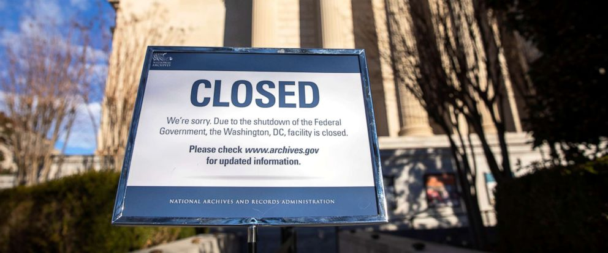

Due to the government shutdown, the data server is currently inaccessible.

---

## 	1. Introduction

For this project, we aim to develop a simple classifier program which can identify existing lake-effect snow represented in the selected area. Moreover, the program is capable of giving suggestions on the type of specific cloud and the formation of the cloud.

### 1.1 What Is Lake-effect Snow

According to the definition, 

> Lake-effect snow is produced during cooler atmospheric conditions when a cold air mass moves across long expanses of warmer lake water, warming the lower layer of air which picks up water vapor from the lake, rises up through the colder air above, freezes and is deposited on the leeward (downwind) shores.  
>  The areas affected by lake-effect snow are called snow-belts. These include areas east of the Great Lakes, the west coasts of northern Japan, the Kamchatka Peninsula in Russia, and areas near the Great Salt Lake, Black Sea, Caspian Sea, Baltic Sea, Adriatic Sea and parts of the northern Atlantic Ocean.      --- ***[Wikipedia Source](https://en.wikipedia.org/wiki/Lake-effect_snow)***

The similar effect may also occur over other types of water bodies. As for our project, we are thoroughly concentrating on the lake-effect. We want to learn and predict the cause and the pattern of the weather phenomenon, which mostly bring not unpredictable damage to citizens around the lake area physically and economically. Hence, this project may benefit users from different perspectives.

### 1.2 Data Source Selection 

As we try to identify lake-effect snow, the weather condition for the lake area is required. With the development of the Geostationary Operational Environmental Satellite (**GOES**) service thanks to National Oceanic and Atmospheric Administration (**NOAA**), we can obtain the accurate continental climate data for the past decade via public access.

In this case scenario, the program relies on the raw weather data image from **[NOAA GOES Weather Toolkit](https://www.ncdc.noaa.gov/wct/)**. The toolkit can provide background maps, animations and necessary filtering for selected bands.

Upon finishing the extraction of the toolkit, users are required to download data from **[NOAA's FTP server](https://www.ncei.noaa.gov/thredds/catalog/satellite/gridsat-goes-conus/catalog.html)**. The climate data is being collected by GOES weather satellite via several camera sensor sets. There are either 13 or 16 spectral bands available depending on the year of operation. These include two visible channels, four near-infrared channels, and ten infrared channels.

Here is a quick reference on all the available bands for selections.

| ABI Band Number | Central Wavelength (µm) |               Notation               | Band Type | Available Year |
|:---------------:|:-----------------------:|:------------------------------------:|:---------:|:--------------:|
|        1        |           0.47          |                 Blue                 |  Visible  |      2007      |
|        2        |           0.64          |                  Red                 |  Visible  |      2007      |
|        3        |           0.86          |                Veggie                |  Near-IR  |      2007      |
|        4        |           1.37          |                Cirrus                |  Near-IR  |      2007      |
|        5        |           1.6           |               Snow/Ice               |  Near-IR  |      2007      |
|        6        |           2.2           |            Cloud Particle            |  Near-IR  |      2007      |
|        7        |           3.9           |           Shortwave Window           |     IR    |      2007      |
|        8        |           6.2           | Upper-Level Tropospheric Water Vapor |     IR    |      2007      |
|        9        |           6.9           |  Mid-Level Tropospheric Water Vapor  |     IR    |      2007      |
|        10       |           7.3           |        Lower-level WaterVapor        |     IR    |      2007      |
|        11       |           8.4           |            Cloud-Top Phase           |     IR    |      2007      |
|        12       |           9.6           |                 Ozone                |     IR    |      2007      |
|        13       |           10.3          |      "Clean" IR Longwave Window      |     IR    |      2013      |
|        14       |           11.2          |          IR Longwave Window          |     IR    |      2013      |
|        15       |           12.3          |        "Dirty" Longwave Window       |     IR    |      2013      |
|        16       |           13.3          |        "CO<sub>2</sub>" longwave infrared       |     IR    |      2013      |

For our project, the program was developed thoroughly based on Band 1 sensor data. The choice was made based on previous academic analysis done by scholars from different Universities. Yet, as GOES satellite contains data from different bands, we can perform data manipulation to extract the desired data, which has not been performed in this field.

* Band 1

  With the lowest central wavelength, Band 1 sensor can capture continuous observations of components ranging from cloud to dust particles. As it covers the spectrum of all natural visible true colors -- Red, Green, and Blue, this band works extremely well during the daytime. The detailed guidance is accessible **[here](https://www.goes-r.gov/education/docs/ABI-bands-FS/ABI%20Band%201%20Fact%20Sheet_Revised%202.24.15.pdf)**. 

  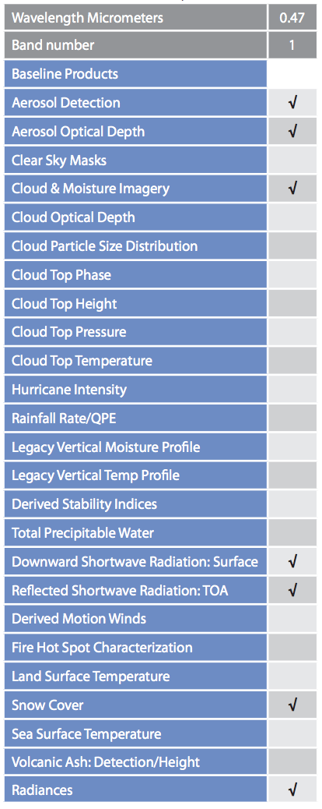

---

* Band 5 &nbsp;&nbsp;&nbsp;&nbsp;&nbsp;&nbsp;&nbsp;&nbsp;&nbsp;&nbsp;&nbsp;&nbsp;&nbsp;&nbsp;&nbsp;&nbsp; ***[Experimental]***

  ``` 
  Disclaim: 
  	This may not be integrated into the final product.
  	Or may only exist as a special mode for the identifier.
  ```
  Terminology:  

  In winter, icing surface and snow may co-exist at a particular geo-location. Base on Band 1 data, they may reflect light with similar visible wavelength, which makes it hard for the program to derive the cloud from the icing surface. 

  > The 1.6 µm band takes advantage of
  the relatively large difference between the refraction components of water and ice. This
  makes daytime water/ice cloud delineation possible.   --- ***[Band 5 Fact Sheet](https://www.goes-r.gov/education/docs/ABI-bands-FS/ABI_Band%205_snow-ice_factsheet_FINAL.pdf)***

  In addition, we are going to focus on two critical wavelengths centered at 1.6 µm and 2.2 µm

  > One of the frustrations that meteorologists sometimes face with satellite imagery is discriminating land features from clouds. Using the 2.2 μm band, forecasters will find that snow, green grass, and certain white
  > sands are all not particularly reflective, in contrast to water clouds. The challenge, however, is that ice
  > cloud is also not very reflective in the 2.2 μm band, making it appear relatively dark in the imagery. Ice cloud is more reflective than what is evident using the 1.6 μm band, though. Outside of New Mexico (and shall we say, “Black Sands”), we anticipate that most forecasters will use the 1.6 μm band and its better spatial resolution in lieu of the 2.2 μm band. That does not suggest that the 2.2 μm band is not without specialized applications, particularly for certain cloud algorithms and “hot spot” detection when fires have an emission temperature of greater than 600 K.   --- ***[Band 5 Fact Sheet](https://www.goes-r.gov/education/docs/ABI-bands-FS/ABI_Band%205_snow-ice_factsheet_FINAL.pdf)***

  Therefore, Band 5 is capable to map out where the existing ice boundaries are. This can potentially help us to isolate the icing areas from the lake to give us a better cloud-only layer, since we can not tell the combination of snow and ice from Band 1 images only.

* Band 6 &nbsp;&nbsp;&nbsp;&nbsp;&nbsp;&nbsp;&nbsp;&nbsp;&nbsp;&nbsp;&nbsp;&nbsp;&nbsp;&nbsp;&nbsp;&nbsp; ***[Experimental]***

  ``` 
  Disclaim: 
  	This may not be integrated into the final product.
  	Or may only exist as a special mode for the identifier.
  ```

  TBA


### 1.3 Data Formatting Selection

The software is designed to take patch input of color image files from any directories pointed by the users. As for now, only PNG image format is supported for the production run.  

### 1.4 Production Server

When it comes to the production server, please make sure to install the following softwares:

| Package Name                                  | Version          | Why                                                          |
| --------------------------------------------- | ---------------- | ------------------------------------------------------------ |
| MATLAB Base/Server                            | 2015a or newer   | Low-effort maintenance; cross-platform support; adopted by other on-going project at rsetserver, so play nice with existing server environment. |
| GNU Compiler Collection                       | GCC 5.5 or newer | For PNG utility tool support for image universal cropping    |
| MATLAB Parallel Processing Toolbox (Optional) | 2015a or newer   | To provide multi-threading support for the application. Rather than executing one image at a time, you could run as many threads as you desired. Only RAM is the limiting factor. |
| Weather Climate Toolkit                       | 4.0.6 or newer   | To extract and convert RAW band data into image format.      |
| Google Earth                                  | 3.5 or newer     | To provide backgroup mapping for the satellite images.       |

---

## 2. Raw Data Retrieving

<kbd> Currently revoked for next update! </kbd> 


[**GOES Server Status:**](https://www.ncei.noaa.gov/thredds/catalog/satellite/gridsat-goes-conus/catalog.html)     [](http://myfakewebsitethatshouldnotexist.at.least.i.hope/)  [](https://bitbucket.org/lbesson/ansi-colors)


In this section, we will walk you though how to obtain the desired RAW band files from GOES FTP server and online tool.

---

## 3. Image Port In/Out

In this section, we will talk about the input data required from the identifier, and the ways to obtain the output results.

### 3.1 Image Format

When it comes to the image format support, the NOAA's Weather and Climate Toolkit can export the data from raw band files to [7 different types of file formats][1]. However, by comparison, the Portable Network Graphics, aka [PNG][2] format is more preferred for the following reasons:

1. Easy for visualization
2. Minimal output file size

When it comes to visualization, the PNG/TIFF format can be opened directly over most system embedded viewer programs, and also being widely supported by browser engines, which can be quickly rendered and integrated to online web tool.

As for the output files, currently, we do not need to include the real geolocation information into the cloud identifier. Therefore, the intensity of each pixel via the Red, Green, Blue channels are the only values required for the identification process.

In particular, the current batch processing settings lead the toolkit to export band images of the selected area to PNG format with lossless data compression to store the `uint8` format more efficiently. For each pixel of the output image, it contains intensity values for 3 different channels with the regard of the RGB color system. It uses the fundamental color set: red, green, blue. Moreover, as for each color, the data is assembled as `uint8` data type. The data type refers to an 8-bit binary value, which translates to 2<sup>8</sup> intensity levels. When we combine 3 different colors, we can yield 16,777,216 different colors. 

### 3.2 Image Port In

When it comes to the identifier, we are utilizing [`imread`][3] from the MATLAB built-in Data Import and Analysis Toolbox. It is capable of importing the image into an array of integers. 

For example, we have an input image of <kbd>sample.png</kbd>, which has a dimension of 1280 pixels in width, and 720 pixels in height. In order to import this target image, we 

```matlab
sample_input = imread('~/sample.png');
```

The imread will simply return a 1280-by-720-by-3 array, and store it into variable named `sample_input`. We can verify it by performing:

```matlab
whos sample_output
```

This will return: (Redo this part)

```matlab
  Name         Size             Bytes  Class    Attributes

  sample      95x212            20140  uint8              
```

Also, we will be able to visualize the image by performing:

```matlab
image(sample_input)
```

This will simply render the input image back to users.

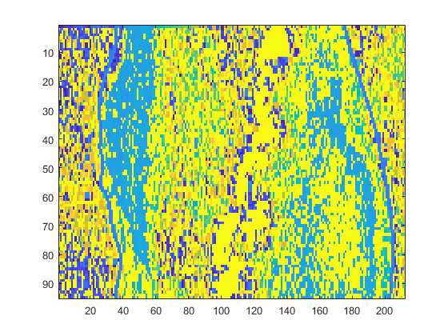

And right after rendering the imported image, you may append the following command to see the single channel value of the imported target:

```matlab
colorbar
```

This will add a slider to reveal the intensity variation to assist you on making decision of choosing the threshold of the cloud intensity. We will talk about that in the later sections.

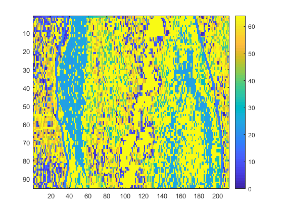

### 3.2 Image Port Out

And when it comes to the post-identification process, after the identifier is done with labeling the cloud area, it will simply return the output images. You may enable the selection to write the output images to your local disk directory.

```matlab
imwrite(sample, 'sample_labeled.png')
```

Also, you may specify your output format by appending the <kbd>fmt</kbd> :

```matlab
imwrite(sample, 'sample_labeled.jpg', 'jpg')
```

As shown above, in this way, we may write out the output in .jpg format.

For certain formats, `imwrite` can accept additional name-value pair arguments. To view these arguments, click the linked format names below.

| Value of `fmt`      | Format of Output File                                        | Description                                                  |
| ------------------- | ------------------------------------------------------------ | ------------------------------------------------------------ |
| `'bmp'`             | Windows® Bitmap (BMP)                                        | 1-bit, 8-bit, and 24-bit uncompressed images                 |
| `'gif'`             | [GIF — Graphics Interchange Format](imwrite.html#mw_aaf7d5b5-c1cd-4151-97ff-3180437a03aa) | 8-bit images                                                 |
| `'hdf'`             | [HDF4 — Hierarchical Data Format](imwrite.html#mw_134beafd-8d56-4746-923b-74f06686cf17) | 8-bit raster image data sets with or without associated colormap, 24-bit raster image data sets |
| `'jpg'` or `'jpeg'` | [JPEG — Joint Photographic Experts Group](imwrite.html#mw_0762e49f-e3b0-4b66-bcfb-0ef235680b4f) | 8-bit, 12-bit, and 16-bit Baseline JPEG imagesNote`imwrite` converts indexed images to RGB before writing data to JPEG files, because the JPEG format does not support indexed images. |
| `'jp2'` or `'jpx'`  | [JPEG 2000— Joint Photographic Experts Group 2000](imwrite.html#mw_e4481d30-6396-4881-8a8a-81f7f2cd061f) | 1-bit, 8-bit, and 16-bit JPEG 2000 images                    |
| `'pbm'`             | [Portable Bitmap (PBM)](imwrite.html#mw_c82bd312-85d7-441a-a000-a486486faa35) | Any 1-bit PBM image, ASCII (plain) or raw (binary) encoding  |
| `'pcx'`             | Windows Paintbrush (PCX)                                     | 8-bit images                                                 |
| `'pgm'`             | [Portable Graymap (PGM)](imwrite.html#mw_c82bd312-85d7-441a-a000-a486486faa35) | Any standard PGM image; ASCII (plain) encoded with arbitrary color depth; raw (binary) encoded with up to 16 bits per gray value |
| `'png'`             | [PNG — Portable Network Graphics](imwrite.html#mw_0bc74011-d2be-41d6-a1a1-eae7fd6be06d) | 1-bit, 2-bit, 4-bit, 8-bit, and 16-bit grayscale images; 8-bit and 16-bit grayscale images with alpha channels; 1-bit, 2-bit, 4-bit, and 8-bit indexed images; 24-bit and 48-bit truecolor images; 24-bit and 48-bit truecolor images with alpha channels |
| `'pnm'`             | [Portable Anymap (PNM)](imwrite.html#mw_c82bd312-85d7-441a-a000-a486486faa35) | Any of the PPM/PGM/PBM formats, chosen automatically         |
| `'ppm'`             | [Portable Pixmap (PPM)](imwrite.html#mw_c82bd312-85d7-441a-a000-a486486faa35) | Any standard PPM image: ASCII (plain) encoded with arbitrary color depth or raw (binary) encoded with up to 16 bits per color component |
| `'ras'`             | Sun™ [Raster (RAS)](imwrite.html#mw_dcbdff21-283a-499d-bdeb-f2c7e96d0a78) | Any RAS image, including 1-bit bitmap, 8-bit indexed, 24-bit truecolor, and 32-bit truecolor with alpha |
| `'tif'` or `'tiff'` | [Tagged Image File Format (TIFF)](imwrite.html#mw_12593ed1-23cf-46a5-8cea-2ac599518ea7) | Baseline TIFF images, including:1-bit, 8-bit, 16-bit, 24-bit, and 48-bit uncompressed images and images with packbits, LZW, or Deflate compression1-bit images with CCITT 1D, Group 3, and Group 4 compressionCIELAB, ICCLAB, and CMYK images |
| `'xwd'`             | X Windows Dump (XWD)                                         | 8-bit ZPixmaps                                               |

---

## 4. Algorithms

In this section, we will walk you through the major procedures about how the program works as a whole.

### 4.1 Image Batch Extraction Configurator

We understand the frustration about the missing map configurator which NOAA used to have listed on their website. Starting on July 1, 2018, NOAA suspended the function for customizing the satellite images. We have reached out to NOAA for the reason and the estimated turn-around time for this functionality to come back online again. The response we received was 

> Hi ~~[Family Safe Contents]~~,
>
> We are currently updating the GOES web-tool. There is no plan on updating the web GUI ordering tool anytime soon since the process would push the limit of the GOES server. This can let down the FTP server opened for general public access.
>
> Hence, sorry for the inconveniences. Meanwhile, the full-disk images are still available via FTP servers.
>
> Thank you for the interests in GOES product. If you need further help, please email to the Helpdesk!

Therefore, if you have already obtained RAW band data from online ordering tool, please directly skip to Section 4.3.

Normally, the batch processing is done via command line terminals. Upon extracting the software into the directory, you may add the software to the global environment of your operating system. If not, please make sure you start the terminal and navigate to the root directory where the software resides at.

In general, the format of the command line which is needed for executing the toolkit should be:

``` powershell
wct-export <in> <out> <format> <config> 
```

When it comes to each cell:

- **<in>** = Input URL, filename or directory. If directory, then all supported files in directory are processed. A URL must be for a specific file, not a directory.
- **<out>** = Output file or directory for processed files. If a directory, then the output files use the input filename. The directory must already exist or it will be treated as a file.
- **<format>** = Output format (use one of the following abbreviations). shp=Shapefile, wkt=Well-Known Text, asc=Arc/Info ASCII Grid, flt=Arc/Info Binary Grid, nc=NetCDF, tif=8-bit grayscale GeoTIFF, tif32=32-bit real value GeoTIFF, csv=Comma-Separated Text File (Alphanumeric-Only), rnc=Raw NetCDF, json=GeoJSON
- **<config>** = XML configuration file for export options. This may be a file or URL.

As we can see here

In addition, you may execute the software by using:

```powershell
wct-export <listfile> <format>
```

Whereas:

- **<listfile>** = Listfile with format of infile/dir/url,outfile/dir,config-xml-file/url. And here is an [sample listfile configuration text](https://www.ncdc.noaa.gov/wct/listfile.txt).
- **<format>** = Output format (use one of the following abbreviations). shp=Shapefile, wkt=Well-Known Text, asc=Arc/Info ASCII Grid, flt=Arc/Info Binary Grid, nc=NetCDF, tif=GeoTIFF, csv=Comma-Separated Text File (Alphanumeric-Only), rnc=Raw NetCDF, json=GeoJSON.

But we do not recommend you to process your batch output in this manner simply due to the effort on generating listfile can take long when you have over hundreds RAW files under the same directory.

And last, when it comes to the XML configuration, rather than listing all the variations here, we would like to introduce [a sample XML configuration](https://www.ncdc.noaa.gov/wct/app/wctBatchConfig.xml) which contains all controllable variables and documentations. 

### 4.2 Raw Image Center-Oriented Cropping (Optional)

We have built a simple progrsm which matches the given template with the series of images given as in input. Python's OpenCV's template matching caabilities are used here  It works under the assumption that the images have/nt been zoomed-in/out. Aslo, the images tend to be very slightly zoomed in as per our observations. This works as a general solution thereby making it easier for it to be used in other projects.

#### 4.2.1 Usage

Simply place the pictures which have to be corrected in the "input_folder", attach a template in the directory of the program and name it "template.JPG". Finally run the program with 

...bash
python image_cropper.py
...

Et voila! Th output should be stored in the output folder.


We have built a simple cropping tool in <kbd>C++</kbd> to provide a more robust cropping which works to format the input images into the same size. Moreover, only the target lake area will be kept for the identification process.

In order to do so, we manually select this block, which is at the upper left of the lake area.

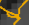

And it is represented as:


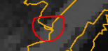

Since this block is fixed on the map as the boundary of the Michigan lake. Therefore, based on the location of this 10 by 10 block, and we are able to get the size and location of the lake represented in the input image.

```powershell
./lakefinder <in_foler> <out_folder> -verbose
```

By adding the tag `-verbose`, you will be able to see the logs if there is one image does not have the full lake area represented, or if the program fails to import the image or export the cropped lake image. This process can only operate in sequential order to avoid any potential errors to stall the program.

### 4.3 Image Normalized Cut Segmentation and Super-Resolution (Optional)

During the development of GOES satellite system, the resolution of the satellite images has improved drastically. Yet, depending on the way how the users extract the lake area images, the resolution of the image can be really small, which results in a poor identification and side-by-side case comparison.

The goal is to design a simple program which can divide and perform the segmentation of an image based on the features and nodes represented in the image. By using this technique, we can extract different features of the image and then perform separated image processing methods rather than treating them as a universal image. Therefore, it can help to minimize the local errors if the image components vary a lot. In this paper, we will talk about the algorithm behind the normalized cut, the experiment conducted based on the specific algorithm, and the performance of the program, along with the possible improvement.

As we mentioned, the image will be imported and quantized as a weighted unidirectional graph. `G = (V, E)` where `V` represents a node allocated and E represents an edge connecting two different nodes. Also, the vertices `𝑣𝑣𝑖𝑖 𝜖𝜖 𝑉𝑉` as `V` is the vertices which represents the set of elements being segmented. We tend to separate the graph, say, into two partition `A` and `B`, where `A∪B=V, A∩B= Ø`. Therefore, we are able to yield: 

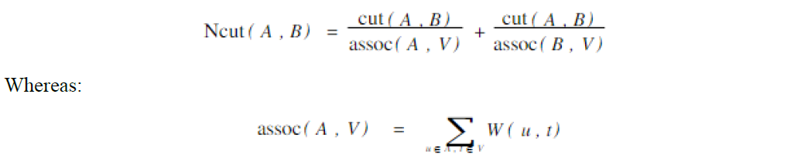

And we can get `assoc(B, V)` similarly. And also for `cut(A, B)`, we have:

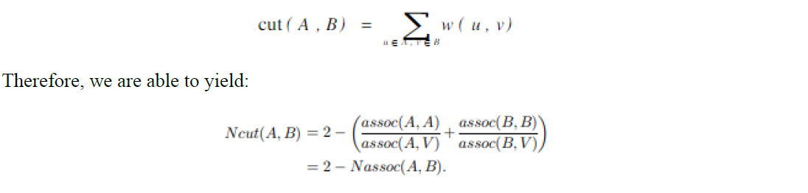

We need to maximize the association within the graph.

The concept is not new, as We and Leahy proposed the base concept. It did reveal the disadvantage that if the noise can be found in the image, if particularly random noise. The noise pixel will be isolated separately and establish an independent node. Therefore, this method is sensitive to the noise represented in the image. Therefore, we need to pre-process the image for denoising by using filters we have learned during the lab in this course, and then perform normalized cut.

As for the graph `G`, we can treat the best partition to be the solution which we are seeking for the minimum value for normalized cut for set `A` and `B`. To represent it in matrix manner, we have:

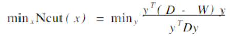

Whereas `D` is a N x N matrix which is diagonal, and `W` is an N x N symmetrical matrix. And as we can see from the equation above, it is in the form of the Rayleigh quotient for complex Hermitian matrix. Therefore, we will be able to convert this problem on solving for:

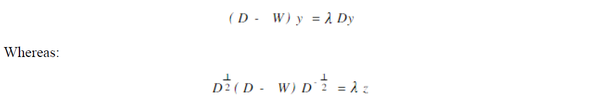

And:

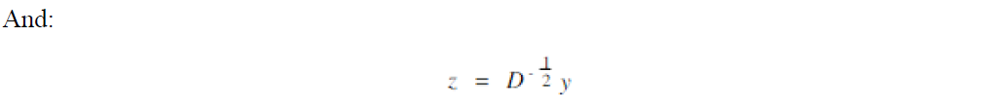

Then, we will be solving for the eigen vectors for the equation above. All the eigenvectors will be perpendicular to each other in this case. Therefore, we are able to yield the solution as:

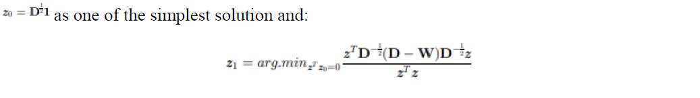

Yet, we know that the run time of the normalized cut is significantly higher than the other methods such as k-means and mean-shift processing, which is partially the reason why it is not applied in most applications which we can find in our daily life due to the high computation cost. However, we can make some compromises to make the algorithm to run faster, such as pre-calculate and normalized the difference in color by

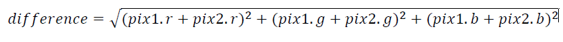

Where as `pix1` refers to the original input, and `pix2` refers to the image being segmented.

On par the observation, we found out that the normalized cut is more suitable to refine the finest details in the image. In addition, it finds number of partitions as the solution of the Rayleigh quotation, rather than as K-mean method, users are more likely to pre-define the number of partitions. But compare to the mean shift algorithm, which is also unsupervised. The mean shift method works well under the condition where noise is high. It is still able to partition the image correctly with the sacrifice of the run time. However, it does not partition the image in great details. Therefore, it will yet make lose in detail by applying the image processing to the areas which are separated as shown in normalized cut method.

And when it comes to image super-resolution, rather than simply upscale the size of the image and make block duplication of the original pixel to the surrounding areas, we perform circular convolution and GNC algorithm for constrained image reconstruction with continuous-valued line processes.

In this way, rather than training the kernel to learn from similar images obtained from the same source, each image has its own kernel for image reconstruction. By doing so, we minimize the potential correlation errors among image set.

### 4.4 Lake Area Crop Off

As we mentioned before, once we align the input images for the identifier, we will be able to clean up the unwanted land areas which surround the lake.

Once the input image has been imported to the identifier, the program will perform matrix operation with lines scanning to detect the boundaries of the lake. 

Since the Weather and Climate Toolkit does not give us a clear boundary information, rather than busy extracting from the band files, we look into the layouts shown in the sample images.

There are 3 different boundary indicators shown in the image:

1. Green lines: This reveals the ocean boundaries surrounding the nations;
2. Orange lines:This reveals the lake and ocean boundaries;
3. Red lines: Highway system and bridge lines.

we noticed that the color of the boundary pixels has a RGB value of `[68, 0, 0]`. This makes it dirty cheap to remove the surrounding areas. By launching loop processing from top, bottom, left and right sides, the image cropper will perform pixel-wise single channel value check to see if the pixel matches with the following conditions:

```matlab
if image(i,j,1)-image(i,j,2) ~= 68 && Orange_counter==0
```

Whereas `i `refers to the row ID of the pixel, `j` refers to the column ID of the pixel. the <span style="color:red">Red</span> channel data resides in `cell(i, j, 1)` , the <span style="color:green">Green</span> channel data resides in `cell(i, j, 2)`, and the <span style="color:blue">Blue</span> channel data resides in `cell(i, j, 3)`.

As for the `Orange_counter`, it simply records if a boundary pixel has been successfully detected. Once detected, it will increase the counter by 1 and re-iterate from the next row/column in order to prevent the identifier from erasing the lake area image. Also, any pixels which was traversed before the boundary pixel will be registered as `[0, 0, 0]` to set the pixel to black color.

Moreover, the orange color boundary locations will be saved into RowID and ColumnID in order to record the lake area for identifier to reduce iteration times.

It is also worth noting that for the cloud and ground layer, the pixels are in grayscale. This simply means the RGB channels contain the same values. Therefore, the intensity of the cloud has a simple range of `[0, 255]`. 

### 4.5 Cloud Pixel Identification

Once the identifier starts, the user will be required to represent 3 data inputs for this process.

Initially, user will be asked to provide the input file directory:

```power
Please enter the test image directory : 
```

Once entered, the program will require user to enter a percentage for classifying the cloud existence:

```power
As we can see here, there are For each image, you need to define the threshold for cloud identification! 

What is the minimum percentage you want as for the typical cloud [0 - 100] : 
```

Since we haven't reach an agreement on the percentage of the cloud area needed to occupy the lake area, as for now, we prompt the user to define the value for each process. Then, for each image file, the program requires a minimum intensity value for defining the pixel to be cloud if and only if it is within the cloud area.

```power
We are now processing the 1 of 14 image
Please specify the cloud color threshold [0 - 255] : 
```

#### 4.5.1 Layer 1 Gap Filling <kbd> Under Construction </kbd>

By default, it will perform a masking to fill out the gaps within the cloud lube by performing a 5 x 5 masking.

If the center pixel and the edge pixels are classified as cloud, it will register all the pixels within the matrix to be cloud pixel. And each cell has a weight score of:

| 1/25 | 1/25 | 1/25 | 1/25 | 1/25 |
| ---- | ---- | ---- | ---- | ---- |
| 1/25 | 3/25 | 3/25 | 3/25 | 1/25 |
| 1/25 | 3/25 | 1    | 3/25 | 1/25 |
| 1/25 | 3/25 | 3/25 | 3/25 | 1/25 |
| 1/25 | 1/25 | 1/25 | 1/25 | 1/25 |

If the matrix block has a overall score over 3, the entire block will be defined as cloud area.

Then, the identifier will normalize the <span style="color:red">Red</span> channel data and the the <span style="color:blue">Blue</span> channel data to highlight the cloud area. As for the <span style="color:blue">Blue</span> channel, it is for general identifier of cloud. And the <span style="color:red">Red</span> tint will assign the major lube of the cloud area.

---

## 5. Results

Hereby, let us represent you with some results from the development.

### 5.1 Sample General Cases

The original image was obtained from February 20, 2008 at 19:00 GMT. The image is from band 1.

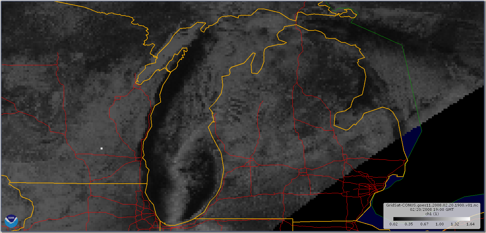

And after the process, we are able to yield:

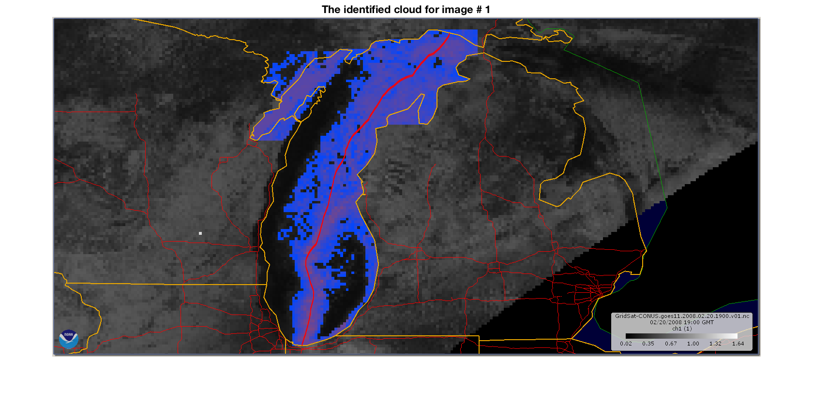

And the terminal outputs:

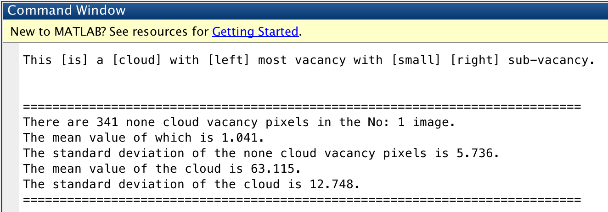

And for another general case, the original image was obtained from January 03, 2011 at 18:32 GMT. The image is from band 1.

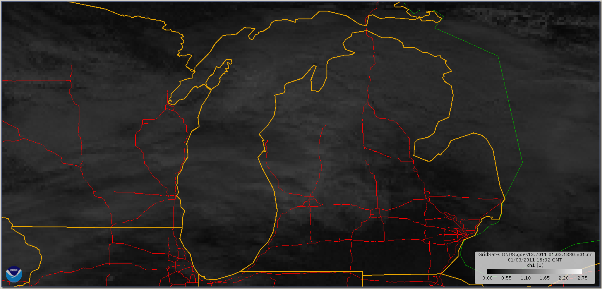

And the identifier yields:


As shown above, the program was able to find out that the major lube of the cloud is closer to the vertical axis of the image. Moreover, the major lube axis connects to at least one of the lake bounds on the top or at the bottom. In the direction which is orthogonal to the major cloud axis, the program is able to find the vacancy in between the left boundary of the lake and the cloud. The gap is larger than 2.5% of the lake width and smaller than the width of the cloud. Hence, it is a typical lake snow effect cloud. Moreover, it is able to find the small vacancy represented on the right side of the cloud. In addition, the cloud area is more than 50% of the overall lake area, which the user defines at the beginning while running the program. This value may vary depending on seasons. Also, the pink area represents the center of the cloud clusters. This can be useful later or separating different cloud effect and icing area on the surface of the lake.

Then, the terminal gives us:

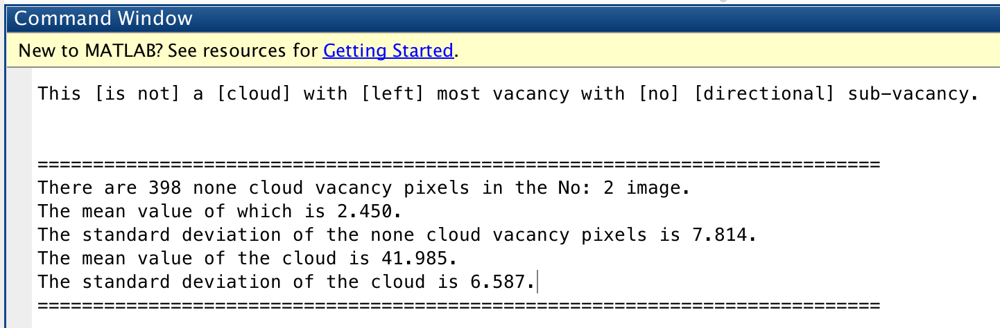

And the third general case, the original image was obtained from January 28, 2014 at 18:45 GMT. The image is from band 1.

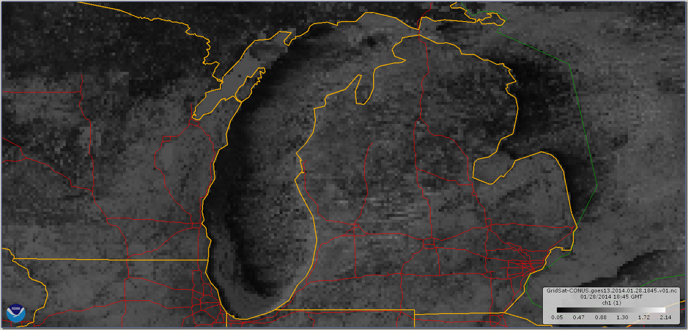

And the identifier yields:

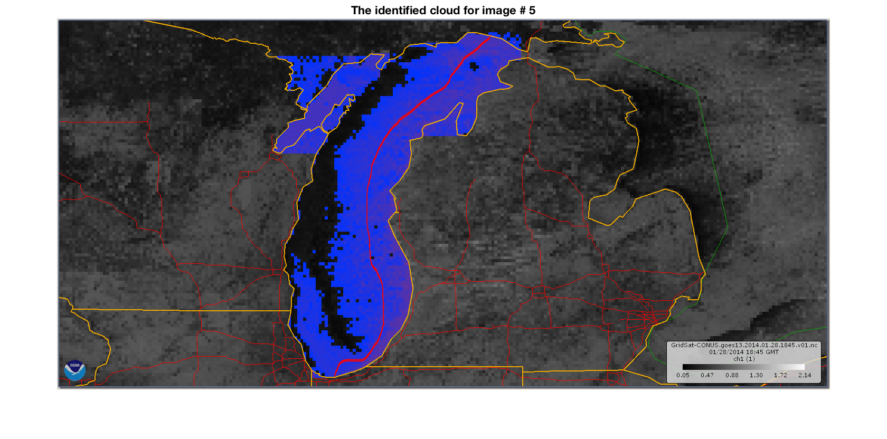

The terminal reveals:

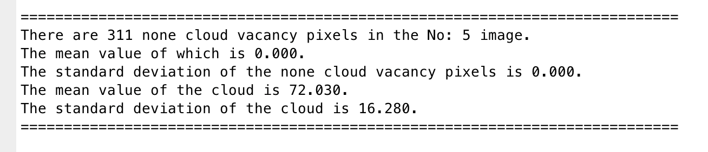

As shown above, this looks like a lake snow effect cloud. However, as you concentrate on the pink labeling on the image, it tells us that the cloud area does not have a significant lobe axis. This means that the cloud is static, which has a low thermal dependency which is different from what the lake snow effect cloud has.  

### 5.2 Super-resolution Samples

With the progress of the the GOES hardware development, the camera sensor resolution for each iterations of the GOES product has been drastically improved. 

Hereby, in case we have data from ancient GOES satellite system, we would like to restore the information from the GOES band 1 data.

By verifying the kernel works, we obtain the original data from:


And perform down sampling to reduce the resolution to match up with GOES 09 system, which was available from 2003 - 2007. 

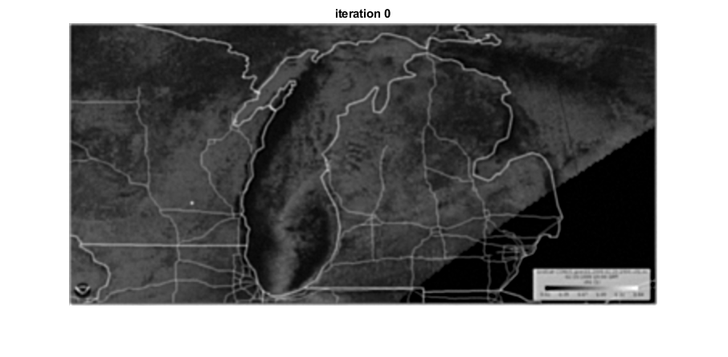

After 20 iterations, we can yield:


And after 15 seconds, we would obtain:


The term **peak signal-to-noise ratio (PSNR)** is an expression for the ratio between the maximum possible value (power) of a signal and the power of distorting noise that affects the quality of its representation.  Because many signals have a very wide **dynamic range**, (ratio between the largest and smallest possible values of a changeable quantity) the **PSNR** is usually expressed in terms of the logarithmic decibel scale.

Image enhancement or improving the visual quality of a digital image can be subjective.  Saying that one method provides a better quality image could vary from person to person.   For this reason, it is necessary to establish quantitative/empirical measures to compare the effects of image enhancement algorithms on image quality.

Using the same set of tests images, different image enhancement algorithms can be compared systematically to identify whether a particular algorithm produces better results.  The metric under investigation is the **peak-signal-to-noise ratio**.  If we can show that an algorithm or set of algorithms can enhance a degraded known image to more closely resemble the original, then we can more accurately conclude that it is a better algorithm.

PSNR is most easily defined via the [mean squared error](https://en.wikipedia.org/wiki/Mean_squared_error) (*MSE*). Given a noise-free *m*×*n* monochrome image *I* and its noisy approximation *K*, *MSE* is defined as:


For the following implementation, let us assume we are dealing with a standard 2D array of data or matrix.  The dimensions of the correct image matrix and the dimensions of the degraded image matrix must be identical.
The mathematical representation of the **PSNR** is as follows:


Here, *MAX<sub>I</sub>* is the maximum possible pixel value of the image. When the pixels are represented using 8 bits per sample, this is 255. More generally, when samples are represented using linear [PCM](https://en.wikipedia.org/wiki/Pulse-code_modulation) with *B* bits per sample, *MAX<sub>I</sub>* is 2<sup>B</sup> − 1.

This can also be represented in a text based format as:

```matlab
MSE = (1/(m*n))*sum(sum((f-g).^2))

PSNR = 20*log(max(max(f)))/((MSE)^0.5)
```

When it comes to the usage of image quality metric, the mean squared error (MSE) for our practical purposes allows us to compare the “true” pixel values of our original image to our degraded image.   The MSE represents the average of the squares of the "errors" between our actual image and our noisy image. The error is the amount by which the values of the original image differ from the degraded image.

The proposal is that the higher the PSNR, the better degraded image has been reconstructed to match the original image and the better the reconstructive algorithm.  This would occur because we wish to minimize the MSE between images with respect the maximum signal value of the image.

When you try to compute the **MSE** between two identical images, the value will be zero and hence the **PSNR** will be undefined (division by zero).  The main limitation of this metric is that it relies strictly on numeric comparison and does not actually take into account any level of biological factors of the human vision system such as the **structural similarity index. (SSIM)**

For color images, with three [RGB](https://en.wikipedia.org/wiki/RGB) values per pixel, the definition of PSNR is the same except the MSE is the sum over all squared value differences divided by image size and by three. Alternately, for color images the image is converted to a different [color space](https://en.wikipedia.org/wiki/Color_space) and PSNR is reported against each channel of that color space, e.g., [YCbCr](https://en.wikipedia.org/wiki/YCbCr) or [HSL](https://en.wikipedia.org/wiki/HSL_and_HSV).

Also, it is worth noting that the MSE is taken over all pixels values of each individual channel and is averaged with the number of color channels.  Another option may be to simply perform the PSNR over a converted luminance or grayscale channel as the eye is generally four times more susceptible to luminance changes as opposed to changes in chrominance.  This approximation is left up to the experimenter.

Typical values for the PSNR in [lossy](https://en.wikipedia.org/wiki/Lossy_compression) image and video compression are between 30 and 50 dB, provided the bit depth is 8 [bits](https://en.wikipedia.org/wiki/Bit), where higher is better. For 16-bit data typical values for the PSNR are between 60 and 80 dB. Acceptable values for wireless transmission quality loss are considered to be about 20 dB to 25 dB.

Then, by performing the PSNR metric to measure the quality of our results. Moreover, we calculated the PSNR over different segments of the super resolution image to see the variation in performance of our algorithm over the different image regions.

|    Region     | Background | Cloud | Water | Boundary | Whole Image |
| :-----------: | :--------: | :---: | :---: | :------: | :---------: |
|   Original    |   28.45    | 15.57 | 16.23 |  24.64   |    21.32    |
| Down Sampled  |   15.90    | 8.16  | 10.23 |  18.38   |    16.25    |
| 20 Iterations |   26.28    | 13.97 | 15.52 |  22.70   |    19.33    |
| 70 Iterations |   30.25    | 16.85 | 17.35 |  25.98   |    22.89    |

As we can see that, the output looks natural and true to the original contents. As we can see here, after 20 iterations, the major information has been restored from its lost compression form. We are able to tell the major features of the lake snow cloud. After 70 iterations, we can find out that the image has been well restored, with its resolution matches with the original content, but the information errors are within a variance of 2. This potentially leads to an error rate of 7.36%.


---

## 6. What's Next

In this section, we will talk about what will be developed and implemented in the future

- [ ] Batch Export for Raw Images
- [ ] Inter-image Interpolation
- [ ] Parallel Processing for Identifier
- [ ] Different band Information Cross Analysis
- [ ] Web Tool for User Online Simulation


---

## 7. References:


[1]: https://www.ncdc.noaa.gov/wct/formats.php
[2]: https://en.wikipedia.org/wiki/Portable_Network_Graphics
[3]: https://www.mathworks.com/help/matlab/import_export/importing-images.html


Reference links are hidden, please jump to the HTML edition of this documentation. (Or put your paws on the highlighted phrases and let Chrome to take you there.)
